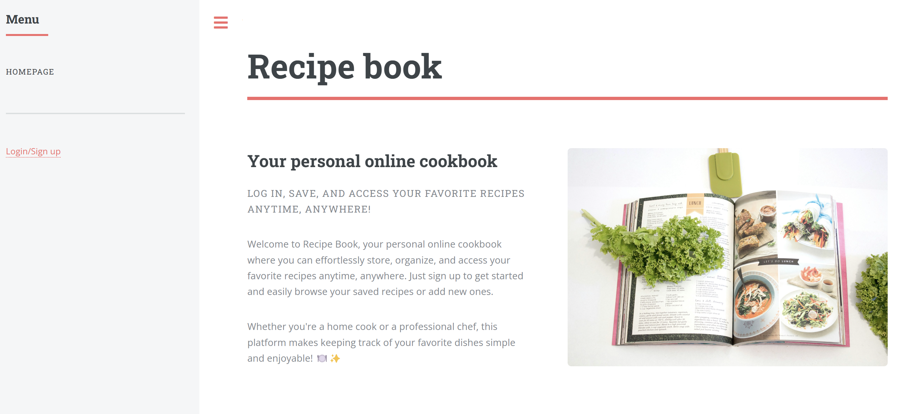
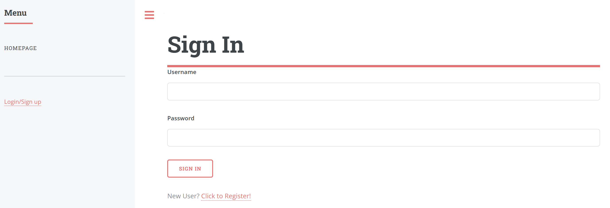
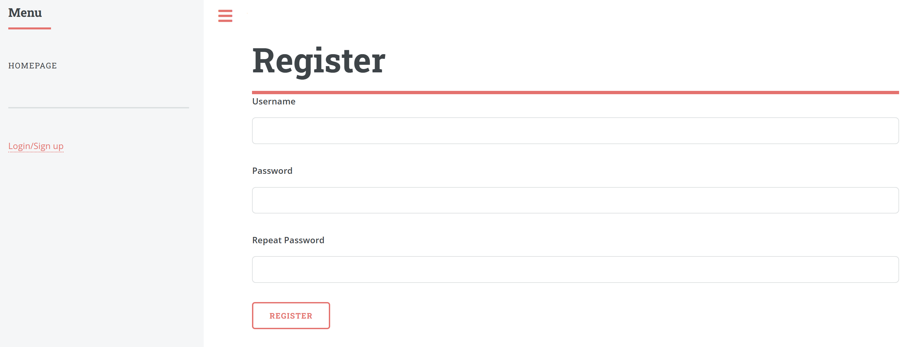
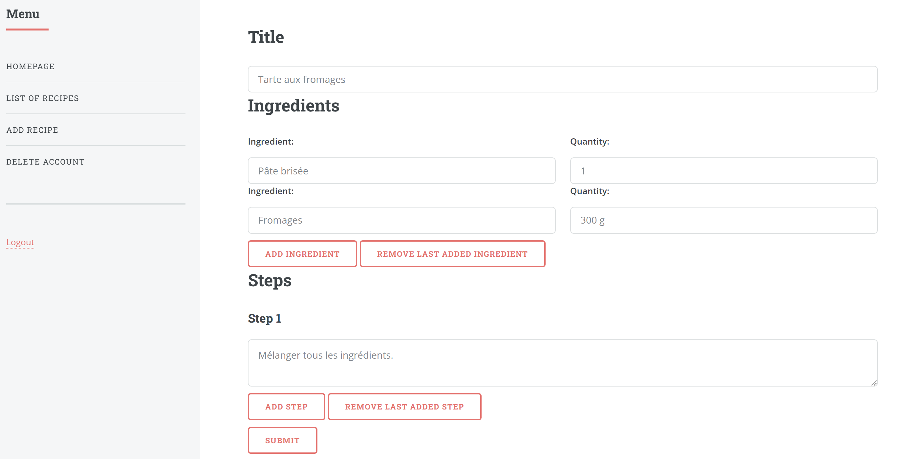
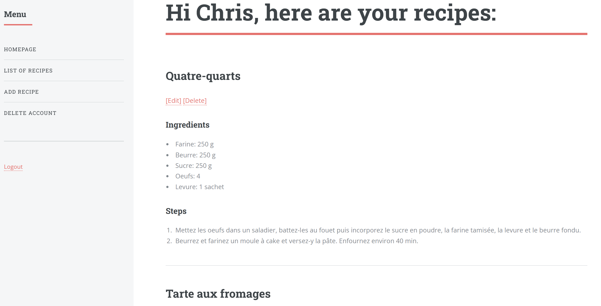
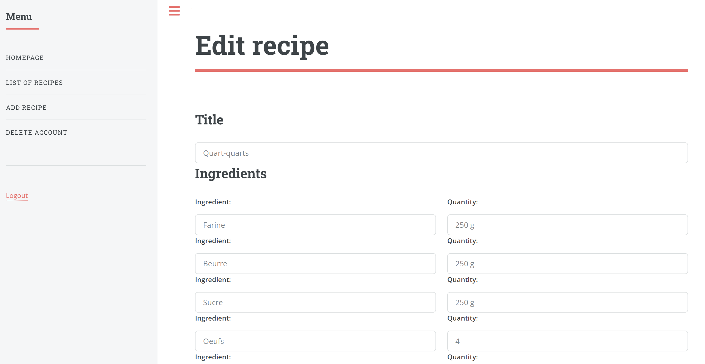
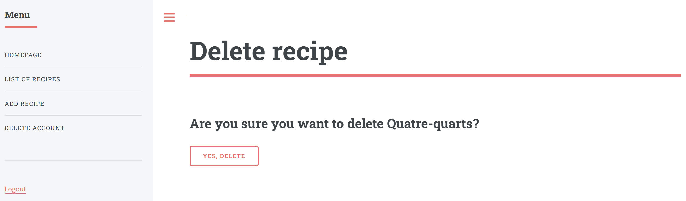
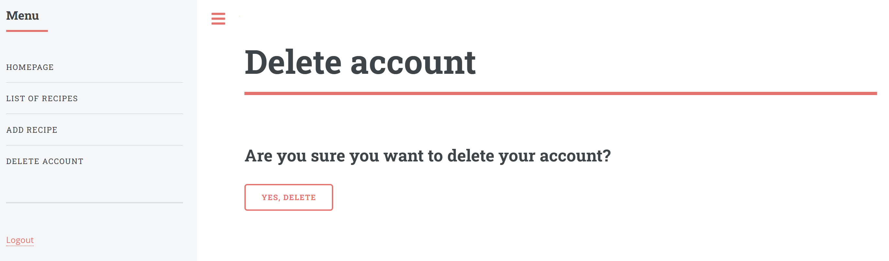
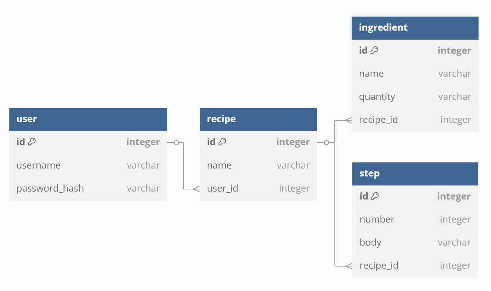

# Recipe book

An application where users can register and add, edit and delete personal recipes. The application is available at this address:

https://recipe-book-5bl4.onrender.com/index/

Please wait one minute while the instance restarts.

## Description

1. When users are not logged in, they only have access to the homepage and the login and registration pages.

2. Once a user has logged in, they can add a recipe with as many ingredients and steps as needed.

3. They can then access to the list of their recipes.

4. Recipes can be edited or deleted.

5. Finally, users can delete their account.

## Database diagram

Here is how the database is organized:

## Technologies used

- Flask (Flask-Login, Flask-SQLALchemy, Flask-WTF)
- JavaScript (for the buttons to add/remove ingredients/steps when adding a recipe)
- Databases
- CRUD operations